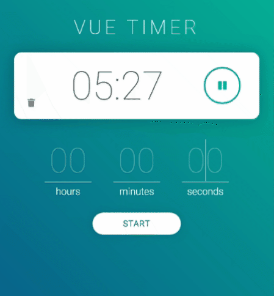

# Vue Timer

A timer web-app built using [Vue.js](https://vuejs.org/).

## Features

- Set multiple timers using hours, minutes, and/or seconds
- Timers display in clock format (hh:mm:ss)
- Pause, restart, and delete existing timers
- Validation of user input (e.g. no negative timers)

## Notes

**[Live Demo](https://martin-gv.com/vuetimer)**

Timers are tracked in 10ms increments for better accuracy when pausing and restarting. User input for new timers is translated to clock format. For example, 90 minutes becomes 1h:30m:00s.

Vue instance methods `$set` and `$delete` are used to safely modify arrays. These methods are syntax sugar for `Array.splice` and `Array.pop`. Vue instance is also saved in a variable for accessing `this` in a global context when using `setInterval` and `setTimeout`.
